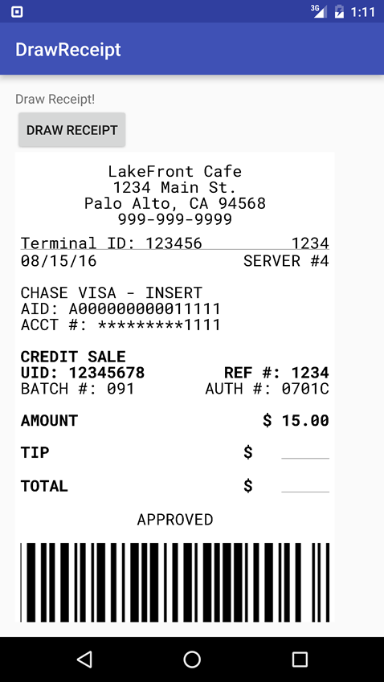

# DrawReceipt
Android lib to draw receipt as bitmap for thermal prints



# Version

0.1.3

# Download
To use this library in your android project, just simply add the following dependency into your build.gradle

```sh
dependencies {
    compile 'com.github.danielfelgar:draw-receipt:0.1.3'
}
```


# Usage

        ReceiptBuilder receipt = new ReceiptBuilder(1200);
        receipt.setMargin(30, 20).
                setAlign(Paint.Align.CENTER).
                setColor(Color.BLACK).
                setTextSize(60).
                setTypeface(this, "fonts/RobotoMono-Regular.ttf").
                addText("LakeFront Cafe").
                addText("1234 Main St.").
                addText("Palo Alto, CA 94568").
                addText("999-999-9999").
                addBlankSpace(30).
                setAlign(Paint.Align.LEFT).
                addText("Terminal ID: 123456", false).
                setAlign(Paint.Align.RIGHT).
                addText("1234").
                setAlign(Paint.Align.LEFT).
                addLine().
                addText("08/15/16", false).
                setAlign(Paint.Align.RIGHT).
                addText("SERVER #4").
                setAlign(Paint.Align.LEFT).
                addParagraph().
                addText("CHASE VISA - INSERT").
                addText("AID: A000000000011111").
                addText("ACCT #: *********1111").
                addParagraph().
                setTypeface(this, "fonts/RobotoMono-Bold.ttf").
                addText("CREDIT SALE").
                addText("UID: 12345678", false).
                setAlign(Paint.Align.RIGHT).
                addText("REF #: 1234").
                setTypeface(this, "fonts/RobotoMono-Regular.ttf").
                setAlign(Paint.Align.LEFT).
                addText("BATCH #: 091", false).
                setAlign(Paint.Align.RIGHT).
                addText("AUTH #: 0701C").
                setAlign(Paint.Align.LEFT).
                addParagraph().
                setTypeface(this, "fonts/RobotoMono-Bold.ttf").
                addText("AMOUNT", false).
                setAlign(Paint.Align.RIGHT).
                addText("$ 15.00").
                setAlign(Paint.Align.LEFT).
                addParagraph().
                addText("TIP", false).
                setAlign(Paint.Align.RIGHT).
                addText("$        ").
                addLine(180).
                setAlign(Paint.Align.LEFT).
                addParagraph().
                addText("TOTAL", false).
                setAlign(Paint.Align.RIGHT).
                addText("$        ").
                addLine(180).
                addParagraph().
                setAlign(Paint.Align.CENTER).
                setTypeface(this, "fonts/RobotoMono-Regular.ttf").
                addText("APPROVED").
                addParagraph().
                addImage(barcode);
        ivReceipt.setImageBitmap(receipt.build());
# Change Logs

### v0.1.3

[UPDATE] Update gradle
[UPDATE] Update Build tools

### v0.1.1

[UPDATE] Update gradle
[UPDATE] Update Build tools
   [BUG] Color Black as default, Align LEFT as default

### v0.1.0

Initial version

# License

Apache 2.0
